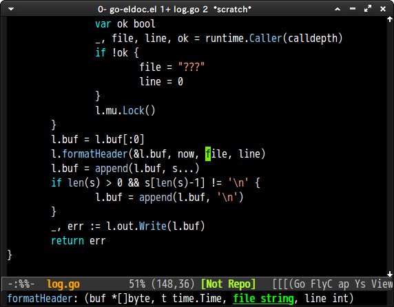

# go-eldoc.el

## Introduction
`go-eldoc.el` provides eldoc for Go language.


## Screenshot




## Dependency

* [gocode](https://github.com/nsf/gocode)
* [go-mode](https://code.google.com/p/go/)

You can install `go-mode` with package.el from [MELPA](http://melpa.milkbox.net/).
And you can install `gocode` by `go get` as below.

```
% go get -u github.com/nsf/gocode
```


## Installation

You can install `go-eldoc.el` from [MELPA](http://melpa.milkbox.net/) with package.el.

```lisp
(require 'package)
(add-to-list 'package-archives '("melpa" . "http://melpa.milkbox.net/packages/"))
(package-initialize)
(package-refresh-contents)
```

evaluate this code and <kbd>M-x package-install go-eldoc</kbd>.


## Setup
Call `go-eldoc-setup` function at `go-mode-hook`

```lisp
(require 'go-eldoc) ;; Don't need to require, if you install by package.el
(add-hook 'go-mode-hook 'go-eldoc-setup)
```

## customize
You can change face of current argument positon by `eldoc-highlight-function-argument`
like this.

```lisp
(set-face-attribute 'eldoc-highlight-function-argument nil
                    :underline t :foreground "green"
                    :weight 'bold)
```
